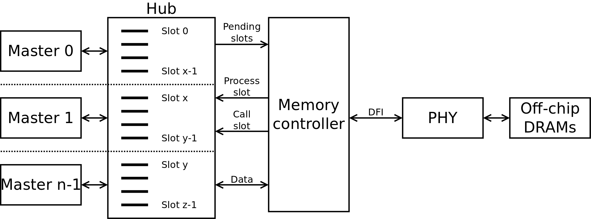

Bus support
###########

Migen Bus contains classes providing a common structure for master and slave interfaces of the following buses:

* Wishbone [wishbone]_, the general purpose bus recommended by Opencores.
* CSR-2 (see :ref:`csr2`), a low-bandwidth, resource-sensitive bus designed for accessing the configuration and status registers of cores from software.
* ASMIbus (see :ref:`asmi`), a split-transaction bus optimized for use with a high-performance, out-of-order SDRAM controller.
* DFI [dfi]_ (partial), a standard interface protocol between memory controller logic and PHY interfaces.

.. [wishbone] http://cdn.opencores.org/downloads/wbspec_b4.pdf
.. [dfi] http://www.ddr-phy.org/

It also provides interconnect components for these buses, such as arbiters and address decoders. The strength of the Migen procedurally generated logic can be illustrated by the following example: ::

  wbcon = wishbone.InterconnectShared(
      [cpu.ibus, cpu.dbus, ethernet.dma, audio.dma],
      [(0, norflash.bus), (1, wishbone2asmi.wishbone),
      (3, wishbone2csr.wishbone)])

In this example, the interconnect component generates a 4-way round-robin arbiter, multiplexes the master bus signals into a shared bus, determines that the address decoding must occur on 2 bits, and connects all slave interfaces to the shared bus, inserting the address decoder logic in the bus cycle qualification signals and multiplexing the data return path. It can recognize the signals in each core's bus interface thanks to the common structure mandated by Migen Bus. All this happens automatically, using only that much user code. The resulting interconnect logic can be retrieved using ``wbcon.get_fragment()``, and combined with the fragments from the rest of the system.

Configuration and Status Registers
**********************************

.. _csr2:

CSR-2 bus
=========
The CSR-2 bus, is a low-bandwidth, resource-sensitive bus designed for accessing the configuration and status registers of cores from software.

It is the successor of the CSR bus used in Milkymist SoC 1.x, with two modifications:

* Up to 32 slave devices (instead of 16)
* Data words are 8 bits (instead of 32)

.. _bank:

Generating register banks
=========================
Migen Bank is a system comparable to wishbone-gen [wbgen]_, which automates the creation of configuration and status register banks and interrupt/event managers implemented in cores.

.. [wbgen] http://www.ohwr.org/projects/wishbone-gen

Bank takes a description made up of a list of registers and generates logic implementing it with a slave interface compatible with Migen Bus.

A register can be "raw", which means that the core has direct access to it. It also means that the register width must be less or equal to the bus word width. In that case, the register object provides the following signals:

* ``r``, which contains the data written from the bus interface.
* ``re``, which is the strobe signal for ``r``. It is active for one cycle, after or during a write from the bus. ``r`` is only valid when ``re`` is high.
* ``w``, which must provide at all times the value to be read from the bus.

Registers that are not raw are managed by Bank and contain fields. If the sum of the widths of all fields attached to a register exceeds the bus word width, the register will automatically be sliced into words of the maximum size and implemented at consecutive bus addresses, MSB first. Field objects have two parameters, ``access_bus`` and ``access_dev``, determining respectively the access policies for the bus and core sides. They can take the values ``READ_ONLY``, ``WRITE_ONLY`` and ``READ_WRITE``.
If the device can read, the field object provides the r signal, which contains at all times the current value of the field (kept by the logic generated by Bank).
If the device can write, the field object provides the following signals:

* ``w``, which provides the value to be written into the field.
* ``we``, which strobes the value into the field.

As a special exception, fields that are read-only from the bus and write-only for the device do not use the ``we`` signal. Instead, the device must permanently drive valid data on the ``w`` signal.

Generating interrupt controllers
================================
The event manager provides a systematic way to generate standard interrupt controllers.

Its constructor takes as parameters one or several *event sources*. An event source is an instance of either:

* ``EventSourcePulse``, which contains a signal ``trigger`` that generates an event when high. The event stays asserted after the ``trigger`` signal goes low, and until software acknowledges it. An example use is to pulse ``trigger`` high for 1 cycle after the reception of a character in a UART.
* ``EventSourceLevel``, which contains a signal ``trigger`` that generates an event on its falling edge. The purpose of this event source is to monitor the status of processes and generate an interrupt on their completion. The signal ``trigger`` can be connected to the ``busy`` signal of a dataflow actor, for example.

The ``EventManager`` provides a signal ``irq`` which is driven high whenever there is a pending and unmasked event. It is typically connected to an interrupt line of a CPU.

The ``EventManager`` provides a method ``get_registers``, that returns a list of registers to be used with Migen Bank. Each event source is assigned one bit in each of those registers. They are:

* ``status``: contains the current level of the trigger line of ``EventSourceLevel`` sources. It is 0 for ``EventSourcePulse``. This register is read-only.
* ``pending``: contains the currently asserted events. Writing 1 to the bit assigned to an event clears it.
* ``enable``: defines which asserted events will cause the ``irq`` line to be asserted. This register is read-write.

.. _asmi:

Advanced System Memory Infrastructure
*************************************

Rationale
=========
The lagging of the DRAM semiconductor processes behind the logic processes has led the industry into a subtle way of ever increasing memory performance.

Modern devices feature a DRAM core running at a fraction of the logic frequency, whose wide data bus is serialized and deserialized to and from the faster clock domain. Further, the presence of more banks increases page hit rate and provides opportunities for parallel execution of commands to different banks.

A first-generation SDR-133 SDRAM chip runs both DRAM, I/O and logic at 133MHz and features 4 banks. A 16-bit chip has a 16-bit DRAM core.

A newer DDR3-1066 chip still runs the DRAM core at 133MHz, but the logic at 533MHz (4 times the DRAM frequency) and the I/O at 1066Mt/s (8 times the DRAM frequency). A 16-bit chip has a 128-bit internal DRAM core. Such a device features 8 banks. Note that the serialization also introduces multiplied delays (e.g. CAS latency) when measured in number of cycles of the logic clock.

To take full advantage of these new architectures, the memory controller should be able to peek ahead at the incoming requests and service several of them in parallel, while respecting the various timing specifications of each DRAM bank and avoiding conflicts for the shared data lines. Going further in this direction, a controller able to complete transfers out of order can provide even more performance by:

#. grouping requests by DRAM row, in order to minimize time spent on precharging and activating banks.
#. grouping requests by direction (read or write) in order to minimize delays introduced by bus turnaround and write recovery times.
#. being able to complete a request that hits a page earlier than a concurrent one which requires the cycling of another bank.

The first two techniques are explained with more details in [drreorder]_.

.. [drreorder] http://www.xilinx.com/txpatches/pub/documentation/misc/improving%20ddr%20sdram%20efficiency.pdf

To enable the efficient implementation of these mechanisms, a new communication protocol with the memory controller must be devised. Migen and Milkymist SoC (-NG) implement their own bus, called ASMIbus, based on the split-transaction principle.

Topology
========
The ASMI consists of a memory controller (e.g. ASMIcon) containing a hub that connects the multiple masters, handles transaction tags, and presents a view of the pending requests to the rest of the memory controller.

Each master has a number of dedicated transaction slots allocated inside the hub. Each slot is assigned a tag, that is later used in the data transfer to identify the slot the data belongs to.

It is suggested that memory controllers use an interface to a PHY compatible with DFI [dfi]_. The DFI clock can be the same as the ASMIbus clock, with optional serialization and deserialization taking place across the PHY, as specified in the DFI standard.

   ASMI topology.

Signals
=======
The ASMIbus consists of two parts: the control signals, and the data signals.

The control signals are used to issue requests.

* Master-to-Hub:

  * ``adr`` communicates the memory address to be accessed. The unit is the word width of the particular implementation of ASMIbus.
  * ``we`` is the write enable signal.
  * ``stb`` qualifies the transaction request, and should be asserted until ``ack`` goes high.

* Hub-to-Master

  * ``tag_issue`` is an integer representing the transaction ("tag") attributed by the hub. The width of this signal is determined by the maximum number of in-flight transactions that the hub port can handle.
  * ``ack`` is asserted when ``tag_issue`` is valid and the transaction has been registered by the hub. A hub may assert ``ack`` even when ``stb`` is low, which means it is ready to accept any new transaction and will do as soon as ``stb`` goes high.

The data signals are used to complete requests.

* Hub-to-Master

  * ``tag_call`` is used to identify the transaction for which the data is "called". It takes the tag value that has been previously attributed by the hub to that transaction during the issue phase.
  * ``call`` qualifies ``tag_call``.
  * ``data_r`` returns data from the DRAM in the case of a read transaction. It is valid for one cycle after CALL has been asserted and ``tag_call`` has identified the transaction. The value of this signal is undefined for the cycle after a write transaction data have been called.

* Master-to-Hub

  * ``data_w`` must supply data to the controller from the appropriate write transaction, on the cycle after they have been called using ``call`` and ``tag_call``.
  * ``data_wm`` are the byte-granular write data masks. They are used in combination with ``data_w`` to identify the bytes that should be modified in the memory. The ``data_wm`` bit should be low for its corresponding ``data_w`` byte to be written.

In order to avoid duplicating the tag matching and tracking logic, the master-to-hub data signals must be driven low when they are not in use, so that they can be simply ORed together inside the memory controller. This way, only masters have to track (their own) transactions for arbitrating the data lines.

Tags represent in-flight transactions. The hub can reissue a tag as soon as the cycle when it appears on ``tag_call``.

SDRAM burst length and clock ratios
===================================
A system using ASMI must set the SDRAM burst length B, the ASMIbus word width W and the ratio between the ASMIbus clock frequency Fa and the SDRAM I/O frequency Fi so that all data transfers last for exactly one ASMIbus cycle.

More explicitly, these relations must be verified:

B = Fi/Fa

W = B*[number of SDRAM I/O pins]

For DDR memories, the I/O frequency is twice the logic frequency.

Using ASMI with Migen
=====================
TODO: please document me!