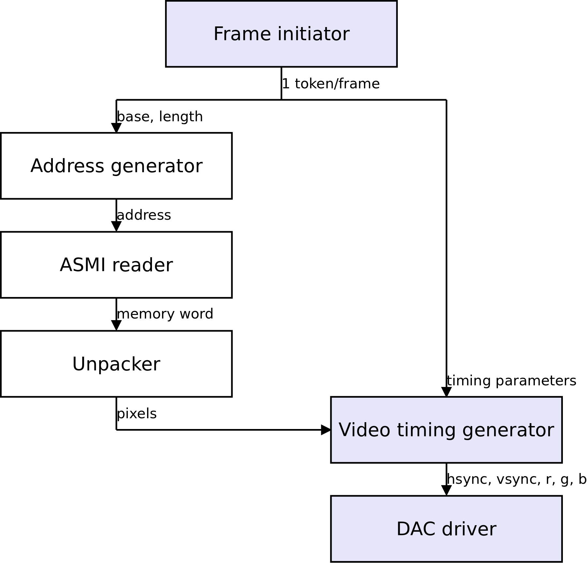

Case studies
############

A VGA framebuffer core
**********************

Purpose
=======

The purpose of the VGA framebuffer core is to scan a buffer in system memory and generate an appropriately timed video signal in order to display the picture from said buffer on a regular VGA monitor.

The core is meant to be integrated in a SoC and is controllable by a CPU which can set parameters such as the framebuffer address, video resolution and timing parameters.

This case study highlights what tools Migen provides to design such a core.

Architecture
============

The framebuffer core is designed using the Migen dataflow system (see :ref:`dataflow`). Its block diagram is given in the figure below:

   Data flow graph of the framebuffer core.

Actors drawn with a blue background are designed specifically for the framebuffer cores, the others are generic actors from the Migen library. Migen also provides the interconnect logic between the actors.

Frame initiator
===============

The frame initiator generates tokens that correspond each to one complete scan of the picture (active video, synchronization pulses, front and back porches). The token contains the address and the length of the framebuffer used for the active video region, and timing parameters to generate the synchronization and porches.

Switching the framebuffer address (without tearing) is simply done by generating a token with the new address.  Tearing will not occur since the new token will accepted only after the one from the previous frame has been processed (i.e. all addresses within the previous frame have been generated).

Video resolution can be changed in a similar way.

To interface with the CPU, the frame initiator uses Migen to provide a CSR bank (see :ref:`bank`).

Pixel fetcher
=============

The pixel fetcher is made up of the address generator, the ASMI reader and the unpacker.

The address generator is a simple counter that takes one token containing the pair ``(base, length)`` and generates ``length`` tokens containing ``base``, ..., ``base+length-1``. It is implemented using a Migen library component (see :ref:`intsequence`).

Those addresses are fed into the ASMI reader (see :ref:`busactors`) that fetches the corresponding locations from the system memory. The ASMI reader design supports an arbitrary number of outstanding requests (which is equal to the number of slots in its ASMI port), which enables it to sustain a high throughput in spite of memory latency. The ASMI reader also contains a reorder buffer and generates memory word tokens in the order of the supplied address tokens, even if the memory system completes the transactions in a different order (see see :ref:`asmi` for information about reordering). These features make it possible to utilize the available memory bandwidth to the full extent, and reduce the need for on-chip buffering.

ASMI memory words are wide and contain several pixels. The unpacking actor (see :ref:`structuring`) takes a token containing a memory word and "chops" it into multiple tokens containing one pixel each.

Video timing generator
======================

The video timing generator is the central piece of the framebuffer core. It takes one token containing the timing parameters of a frame, followed by as many tokens as there are pixels in the frame. It generates tokens containing the status of the horizontal/vertical synchronization signals and red/green/blue values. When the contents of those tokens are sent out at the pixel clock rate (and the red/green/blue value converted to analog), they form a valid video signal for one frame.

DAC driver
==========

The DAC driver accepts and buffers the output tokens from the video timing generator, and sends their content to the DAC and video port at the pixel clock rate using an asynchronous FIFO.
