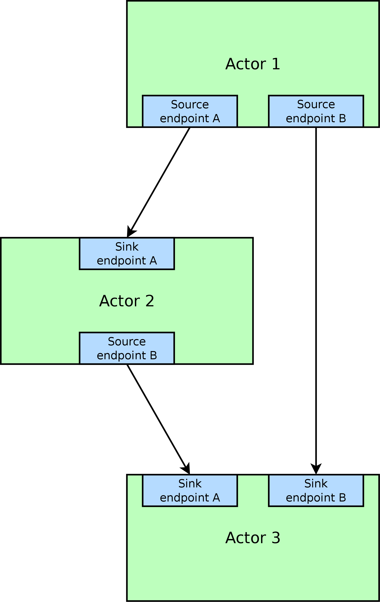

Dataflow
########

Many hardware acceleration problems can be expressed in the dataflow paradigm. It models a program as a directed graph of the data flowing between functions. The nodes of the graph are functional units called actors, and the edges represent the connections (transporting data) between them.

Actors communicate by exchanging data units called tokens. A token contains arbitrary (user-defined) data, which is a record containing one or many fields, a field being a bit vector or another record. Token exchanges are atomic (i.e. all fields are transferred at once from the transmitting actor to the receiving actor).

Actors
******

Actors and endpoints
====================

Actors in Migen are implemented in FHDL. This low-level approach maximizes the practical flexibility: for example, an actor can manipulate the bus signals to implement a DMA master in order to read data from system memory (see :ref:`busactors`).

Token exchange ports of actors are called endpoints. Endpoints are unidirectional and can be sources (which transmit tokens out of the actor) or sinks (which receive tokens into the actor).

   Actors and endpoints.

The flow of tokens is controlled using two handshake signals (strobe and acknowledgement) which are implemented by every endpoint. The strobe signal is driven by sources, and the acknowledgement signal by sinks.

======= ======= ====================================================================================================
``stb`` ``ack`` Situation
======= ======= ====================================================================================================
0       0       The source endpoint does not have data to send, and the sink endpoint is not ready to 
                accept data.
0       1       The sink endpoint is ready to accept data, but the source endpoint has currently no data
                to send. The sink endpoint is not required to keep its ``ack`` signal asserted.
1       0       The source endpoint is trying to send data to the sink endpoint, which is currently not
                ready to accept it. The transaction is *stalled*. The source endpoint must keep ``stb``
                asserted and continue to present valid data until the transaction is completed.
1       1       The source endpoint is sending data to the sink endpoint which is ready to accept it. The
                transaction is *completed*. The sink endpoint must register the incoming data, as the
                source endpoint is not required to hold it valid at the next cycle.
======= ======= ====================================================================================================

It is permitted to generate an ``ack`` signal combinatorially from one or several ``stb`` signals. However, there should not be any combinatorial path from an ``ack`` to a ``stb`` signal.

Actors are derived from the the ``migen.flow.actor.Actor`` base class. The constructor of this base class takes a variable number of parameters, each describing one endpoint of the actor.

An endpoint description is a triple consisting of:

* The endpoint's name.
* A reference to the ``migen.flow.actor.Sink`` or the ``migen.flow.actor.Source`` class, defining the token direction of the endpoint.
* The layout of the data record that the endpoint is dealing with.

Record layouts are a list of fields. Each field is described by a pair consisting of:

* The field's name.
* Either a BV object (see :ref:`bv`) if the field is a bit vector, or another record layout if the field is a lower-level record.

For example, this code: ::

  Actor(
    ("operands", Sink, [("a", BV(16)), ("b", BV(16))]),
    ("result", Source, [("r", BV(17))]))

creates an actor with:

* One sink named ``operands`` accepting data structured as a 16-bit field ``a`` and a 16-bit field ``b``. Note that this is functionally different from having two endpoints ``a`` and ``b``, each accepting a single 16-bit field. With a single endpoint, the data is strobed when *both* ``a`` and ``b`` are valid, and ``a`` and ``b`` are *both* acknowledged *atomically*. With two endpoints, the actor has to deal with accepting ``a`` and ``b`` independently. Plumbing actors (see :ref:`plumbing`) and abstract networks (see :ref:`actornetworks`) provide a systematic way of converting between these two behaviours, so user actors should implement the behaviour that results in the simplest or highest performance design.
* One source named ``result`` transmitting a single 17-bit field named ``r``.

Implementing the functionality of the actor can be done in two ways:

* Overloading the ``get_fragment`` method.
* Overloading both the ``get_control_fragment`` and ``get_process_fragment`` methods. The ``get_control_fragment`` method should return a fragment that manipulates the control signals (strobes, acknowledgements and the actor's busy signal) while ``get_process_fragment`` should return a fragment that manipulates the token payload. Overloading ``get_control_fragment`` alone allows you to define abstract actor classes implementing a given scheduling model. Migen comes with a library of such abstract classes for the most common schedules (see :ref:`schedmod`).

Accessing the endpoints is done via the ``endpoints`` dictionary, which is keyed by endpoint names and contains instances of the ``migen.flow.actor.Endpoint`` class. The latter holds:

* A signal object ``stb``.
* A signal object ``ack``.
* The data payload ``token``. The individual fields are the items (in the Python sense) of this object.

Busy signal
===========

The basic actor class creates a ``busy`` control signal that actor implementations should drive.

This signal represents whether the actor's state holds information that will cause the completion of the transmission of output tokens. For example:

* A "buffer" actor that simply registers and forwards incoming tokens should drive 1 on ``busy`` when its register contains valid data pending acknowledgement by the receiving actor, and 0 otherwise.
* An actor sequenced by a finite state machine should drive ``busy`` to 1 whenever the state machine leaves its idle state.
* An actor made of combinatorial logic is stateless and should tie ``busy`` to 0.

.. _schedmod:

Common scheduling models
========================

For the simplest and most common scheduling cases, Migen provides logic to generate the handshake signals and the busy signal. This is done through abstract actor classes that overload ``get_control_fragment`` only, and the user should overload ``get_process_fragment`` to implement the actor's payload.

These classes are usable only when the actor has exactly one sink and one source (but those endpoints can contain an arbitrary data structure), and in the cases listed below.

Combinatorial
-------------
The actor datapath is made entirely of combinatorial logic. The handshake signals pass through. A small integer adder would use this model.

This model is implemented by the ``migen.flow.actor.CombinatorialActor`` class. There are no parameters or additional control signals.

N-sequential
------------
The actor consumes one token at its input, and it produces one output token after N cycles. It cannot accept new input tokens until it has produced its output. A multicycle integer divider would use this model.

This model is implemented by the ``migen.flow.actor.SequentialActor`` class. The constructor of this class takes as parameter the number of cycles N. The class provides an extra control signal ``trigger`` that pulses to 1 for one cycle when the actor should register the inputs and start its processing. The actor is then expected to provide an output after the N cycles and hold it constant until the next trigger pulse.

N-pipelined
-----------
This is similar to the sequential model, but the actor can always accept new input tokens. It produces an output token N cycles of latency after accepting an input token. A pipelined multiplier would use this model.

This model is implemented by the ``migen.flow.actor.PipelinedActor`` class. The constructor takes the number of pipeline stages N. There is an extra control signal ``pipe_ce`` that should enable or disable all synchronous statements in the datapath (i.e. it is the common clock enable signal for all the registers forming the pipeline stages).

The Migen actor library
***********************

.. _plumbing:

Plumbing actors
===============

Plumbing actors arbitrate the flow of data between actors. For example, when a source feeds two sinks, they ensure that each sink receives exactly one copy of each token transmitted by the source.

Most of the time, you will not need to instantiate plumbing actors directly, as abstract actor networks (see :ref:`actornetworks`) provide a more powerful solution and let Migen insert plumbing actors behind the scenes.

Buffer
------

The ``Buffer`` registers the incoming token and retransmits it. It is a pipelined actor with one stage. It can be used to relieve some performance problems or ease timing closure when many levels of combinatorial logic are accumulated in the datapath of a system.

When used in a network, abstract instances of ``Buffer`` are automatically configured by Migen (i.e. the appropriate token layout is set).

Combinator
----------

This actor combines tokens from several sinks into one source.

For example, when the operands of a pipelined multiplier are available independently, the ``Combinator`` can turn them into a structured token that is sent atomically into the multiplier when both operands are available, simplifying the design of the multiplier actor.

Splitter
--------

This actor does the opposite job of the ``Combinator``. It receives a token from its sink, duplicates it into an arbitrary number of copies, and transmits one through each of its sources. It can optionally omit certain fields of the token (i.e. take a subrecord).

For example, an Euclidean division actor generating the quotient and the remainder in one step can transmit both using one token. The ``Splitter`` can then forward the quotient and the remainder independently, as integers, to other actors.

Structuring actors
==================

Cast
----

This actor concatenates all the bits from the data of its sink (in the order as they appear in the layout) and connects them to the raw bits of its source (obtained in the same way). The source and the sink layouts must contain the same number of raw bits. This actor is a simple "connect-through" which does not use any hardware resources.

It can be used in conjunction with the bus master actors (see :ref:`busactors`) to destructure (resp. structure) data going to (resp. coming from) the bus.

Unpack
------

This actor takes a token with the fields ``chunk0`` ... ``chunk[N-1]`` (each having the same layout L) and generates N tokens with the layout L containing the data of ``chunk0`` ... ``chunk[N-1]`` respectively.

Pack
----

This actor receives N tokens with a layout L and generates one token with the fields ``chunk0`` ... ``chunk[N-1]`` (each having the same layout L) containing the data of the N incoming tokens respectively.

Simulation actors
=================

When hardware implementation is not desired, Migen lets you program actor behaviour in "regular" Python.

For this purpose, it provides a ``migen.actorlib.sim.SimActor`` class. The constructor takes a generator as parameter, and a list of endpoints (similarly to the base ``migen.flow.actor.Actor`` class). The generator implements the actor's behaviour.

Generators can yield ``None`` (in which case, the actor does no transfer for one cycle) or one or a tuple of instances of the ``Token`` class. Tokens for sink endpoints are pulled and the "value" field filled in. Tokens for source endpoints are pushed according to their "value" field. The generator is run again after all transactions are completed.

The possibility to push several tokens at once is important to interact with actors that only accept a group of tokens when all of them are available.

The ``Token`` class contains the following items:

* The name of the endpoint from which it is to be received, or to which it is to be transmitted. This value is not modified by the transaction.
* A dictionary of values corresponding to the fields of the token. Fields that are lower-level records are represented by another dictionary. This item should be set to ``None`` (default) when receiving from a sink.

Arithmetic and logic actors
===========================

The ``migen.actorlib.ala`` module provides arithmetic and logic actors for the usual integer operations.

If complex operation combinations are needed, the ``ComposableNode`` class can be used. It overloads Python operators to make them instantiate the arithmetic and logic actors and connect them into an existing network. This creates a small internal domain-specific language (DSL).

The ``ComposableNode`` class is a derivative of the ``ActorNode`` class (see :ref:`actornetworks`) and should be used in the place of the latter when the DSL feature is desired.

.. _busactors:

Bus actors
==========

Migen provides a collection of bus-mastering actors, which makes it possible for dataflow systems to access system memory easily and efficiently.

Wishbone reader
---------------

The ``migen.actorlib.dma_wishbone.reader`` takes a token representing a 30-bit Wishbone address (expressed in words), reads one 32-bit word on the bus at that address, and transmits the data.

It does so using Wishbone classic cycles (there is no burst or cache support). The actor is pipelined and its throughput is only limited by the Wishbone stall cycles.

Wishbone writer
---------------

The ``migen.actorlib.dma_wishbone.writer`` takes a token containing a 30-bit Wishbone address (expressed in words) and a 32-bit word of data, and writes that word to the bus.

Only Wishbone classic cycles are supported. The throughput is limited by the Wishbone stall cycles only.

ASMI reader
-----------

TODO (status: prototype available, sequential without reorder buffer)

ASMI writer
-----------

TODO

.. _actornetworks:

Actor networks
**************

Graph definition
================

Migen represents an actor network using the ``migen.flow.network.DataFlowGraph`` class. It is derived from ``MultiDiGraph`` from the NetworkX [networkx]_ library.

.. [networkx] http://networkx.lanl.gov/

Nodes of the graph are instances of the ``migen.flow.network.ActorNode`` class. The latter can represent actors in two ways:

* A reference to an existing actor (*physical actor*).
* An class and a dictionary (*abstract actor*), meaning that the actor class should be instantiated with the parameters from the dictionary. This form is needed to enable optimizations such as actor duplication or sharing during elaboration.

Edges of the graph represent the flow of data between actors. They have the following data properties:

* ``source``: a string containing the name of the source endpoint, which can be ``None`` (Python's ``None``, not the string ``"None"``) if the transmitting actor has only one source endpoint.
* ``sink``: a string containing the name of the sink endpoint, which can be ``None`` if the transmitting actor has only one sink endpoint.
* ``source_subr``: if only certain fields (a subrecord) of the source endpoint should be included in the connection, their names are listed in this parameter. The ``None`` value connects all fields.
* ``sink_subr``: if the connection should only drive certain fields (a subrecord) of the sink endpoint, they are listed here. The ``None`` value connects all fields.

Compared to NetworkX's ``MultiDiGraph`` it is based on, Migen's ``DataFlowGraph`` class implements an additional method that makes it easier to add actor connections to a graph: ::

  add_connection(source_node, sink_node,
    source_ep=None, sink_ep=None, # default: assume nodes have 1 source/sink
                                  # and use that one
    source_subr=None, sink_subr=None) # default: use whole record

Abstract and physical networks
==============================

A network (or graph) is abstract if it cannot be physically implemented by only connecting existing records  together. More explicitly, a graph is abstract if any of these conditions is met:

#. A node is an abstract actor.
#. A subrecord is used at a source or a sink.
#. A single source feeds more than one sink.

The ``DataFlowGraph`` class implements a method ``is_abstract`` that tests and returns if the network is abstract.

An abstract graph can be turned into a physical graph through *elaboration*.

Elaboration
===========

The most straightforward elaboration process goes as follows:

#. Whenever several sources drive different fields of a single sink, insert a ``Combinator`` plumbing actor. A ``Combinator`` should also be inserted when a single source drive only certain fields of a sink.
#. Whenever several sinks are driven by a single source (possibly by different fields of that source), insert a ``Splitter`` plumbing actor. A ``Splitter`` should also be inserted when only certain fields of a source drive a sink.
#. Whenever an actor is abstract, instantiate it.

This method is implemented by default by the ``elaborate`` method of the ``DataFlowGraph`` class, that modifies the graph in-place.

Thanks to abstract actors, there are optimization possibilities during this stage:

* Time-sharing an actor to reduce resource utilization.
* Duplicating an actor to increase performance.
* Promoting an actor to a wider datapath to enable time-sharing with another. For example, if a network contains a 16-bit and a 32-bit multiplier, the 16-bit multiplier can be promoted to 32-bit and time-shared.
* Algebraic optimizations.
* Removing redundant actors whose output is only used partially. For example, two instances of divider using the restoring method can be present in a network, and each could generate either the quotient or the remainder of the same integers. Since the restoring method produces both results at the same time, only one actor should be used instead.

None of these optimizations are implemented yet.

Implementation
==============

A physical graph can be implemented and turned into a synthesizable or simulable fragment using the ``migen.flow.network.CompositeActor`` actor.

Performance tools
*****************

High-level actor description
****************************

.. WARNING::
   Not implemented yet, just an idea.

It is conceivable that a CAL [cal]_ to FHDL compiler be implemented at some point, to support higher level descriptions of some actors and reuse of third-party RVC-CAL applications. [orcc]_ [orcapps]_ [opendf]_

.. [cal] http://opendf.svn.sourceforge.net/viewvc/opendf/trunk/doc/GentleIntro/GentleIntro.pdf
.. [orcc] http://orcc.sourceforge.net/
.. [orcapps] http://orc-apps.sourceforge.net/
.. [opendf] http://opendf.sourceforge.net/
