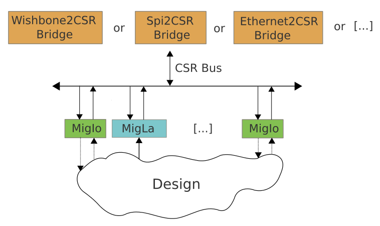

Introduction
############

MigScope is a small logic analyzer to be embedded in an FPGA.

While free vendor toolchains are generally used by beginners or for prototyping ( situations where having a logic analyser in the design is generally very helpfull) free toolchains are always provided without the proprietary logic analyzer solution. . . :(

Based on Migen, MigScope aims to provide a free and more portable / flexible alternative to vendor's solutions.

About Migen
***********
Migen is a Python-based tool that aims at automating further the VLSI design process. [*]_

.. [*] More information on Migen on : http://github.com/milkymist/migen

Migen makes it possible to apply modern software concepts such as object-oriented programming and metaprogramming to design hardware. This results in more elegant and easily maintained designs and reduces the incidence of human errors.

Installing MigScope
*******************
Either run the setup.py installation script or simply set PYTHONPATH to the root of the source directory.

Feedback
********
Feedback concerning MigScope or this manual should be sent to florent@enjoy-digital.fr

The MigScope Structure
######################

Migscope provides two kinds of cores:

  - MigIo : the virtual Input / Output core
  - MigLa : the virtual Logic Analyser core

A CSR bus controls the MigIo and MigLa cores. The CSR bus is a very simple bus originally used to control peripheral registers in milkymist Soc.[*]_

.. [*] More information on Milkymist on : http://github.com/milkymist/milkymist-ng

Because of its simplicity, it can be adapted very easily to a wide range of interfaces: Wishbone, Uart, Spi, I2C, Ethernet...

MigScope uses CSR library from Migen to inter-connect the cores. MigScope provides a Spi2Csr Bridge and is tested with an external Spi Interface. Support for others externals interfaces will be added in future versions.

Because Migen is a Python-based tool, using Python to control MigScope gives lot's of advantages : Python classes can provide the HDL description **AND** driver functions!

MigIo
#####

Description
-----------

The MigIo is simply an internal GPIO equivalent. It provides N (configurable) inputs and/or outputs and can be used for lots of purposes:

  - stimulation of a core's parameters in a design where external control interface is not yet developped or still under developpement.
  - update of a Look-Up-Table or a Ram.
  - read an internal / external bus.
  - ...

.. image:: Illustrations/migIo.png

Instanciation
-------------
::

  MIGIO_ADDR = 0x0000
  migIo0 = migIo.MigIo(MIGIO_ADDR, 8, "IO")

MigIo parameters are:

  - CSR address : core base Address
  - Bus width : size of input / output buses. **(a power of two)**
  - mode : "I" for input, "O" for output, "IO" for both

Driver
------
To use drivers functions, an interface is defined::

  csr = Uart2Spi(1,115200)
  migIo0 = migIo.MigIo(MIGIO_ADDR, 8, "IO", csr)

MigIo drivers functions will now use our csr interface. Note that it's only useful to define the migIo interface in the Python code that will be executed on the Host, the code that will be translated in HDL don't need it.

Write Method::

  migIo0.write(0x1234, 0x5A)
Write parameters are:

  - CSR Address
  - Data

Read Method::

  migIo0.read(0x1234)

Read parameters are:

  - CSR Address

Example Design
--------------

de0_nano and de1 examples instanciate a MigIo Core.

The HDL Code is in examples/deX/top.py

The Host Code is in examples/deX/client/test_MigIo.py

MigLa
#####

[To Be Done]