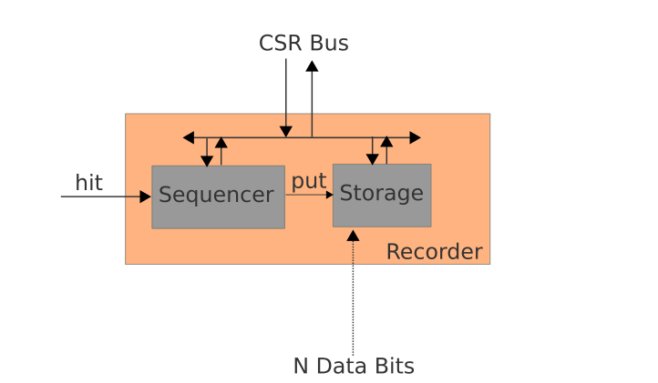

Introduction
############

Miscope is a small logic analyzer to be embedded in an FPGA.

While free vendor toolchains are generally used by beginners or for prototyping (situations where having a logic analyser in the design is generally very helpful) free toolchains are always provided without the proprietary logic analyzer solution. . . :(

Based on Migen, Miscope aims to provide a free and portable / flexible alternative to vendor's solutions.

About Migen
***********
Migen is a Python-based tool that aims at automating further the VLSI design process. [*]_

.. [*] More information on Migen on : http://github.com/milkymist/migen

Migen makes it possible to apply modern software concepts such as object-oriented programming and metaprogramming to design hardware. This results in more elegant and easily maintained designs and reduces the incidence of human errors.

Installing Miscope
*******************
Either run the setup.py installation script or simply set PYTHONPATH to the root of the source directory.

Feedback
********
Feedback concerning Miscope or this manual should be sent to florent@enjoy-digital.fr

The Miscope Structure
######################

Miscope provides two kinds of cores:

  - MiIo : the virtual Input / Output core
  - MiLa : the virtual Logic Analyser core

A CSR bus controls the MiIo and MiLa cores. The CSR bus is a very simple bus originally used to control peripheral registers in milkymist Soc.[*]_

.. [*] More information on Milkymist on : http://github.com/milkymist/milkymist-ng

Because of its simplicity, it can be adapted very easily to a wide range of interfaces: Wishbone, Uart, Spi, I2C, Ethernet...

Miscope uses CSR library from Migen to inter-connect the cores. Miscope provides a Spi2Csr Bridge and is tested with an external Spi Interface. Support for others externals interfaces will be added in future versions.

Because Migen is a Python-based tool, using Python to control Miscope gives lot's of advantages : Python classes can provide the HDL description **AND** driver functions!

.. image:: Illustrations/Miscope_structure.png

MiIo
#####

Description
-----------

The MiIo is simply an internal GPIO equivalent. It provides N (configurable) inputs and/or outputs and can be used for lots of purposes:

  - stimulation of a core's parameters in a design where external control interface is not yet developped or still under developpement.
  - update of a Look-Up-Table or a Ram.
  - read an internal / external bus.
  - ...

.. image:: Illustrations/MiIo.png

Instanciation
-------------
::

  MIIO_ADDR = 0x0000
  MiIo0 = MiIo.MiIo(MiIo_ADDR, 8, "IO")

MiIo parameters are:

  - CSR address : core base Address
  - Bus width : size of input / output buses. **(a power of two)**
  - mode : "I" for input, "O" for output, "IO" for both

Driver
------
To use drivers functions, an interface is defined::

  csr = Uart2Spi(1,115200)
  MiIo0 = MiIo.MiIo(MIIO_ADDR, 8, "IO", csr)

MiIo drivers functions will now use our csr interface. Note that it's only useful to define the MiIo interface in the Python code that will be executed on the Host, the code that will be translated in HDL don't need it.

Write Method::

  MiIo0.write(0x1234, 0x5A)
Write parameters are:

  - CSR Address
  - Data

Read Method::

  MiIo0.read(0x1234)

Read parameters are:

  - CSR Address

Examples Design
---------------

de0_nano and de1 examples instanciate a MiIo Core.

The HDL Code is in examples/deX/top.py

The Host Code is in examples/deX/client/test_MiIo.py

MiLa
#####

Description
-----------

The MiLa is the Logic Analyser core, it provides N (configurable) Trigger bits and M (Configurable) Data bits:

.. image:: Illustrations/MiLa.png

Each MiLa instance is composed of a Trigger and a Recorder controlled by the CSR Bus:

.. image:: Illustrations/MiLa_structure.png

The Trigger is configured by the user to detect particular events on the N Trigger bits. Once detected, the hit signal rise.

The Recorder is armed by the user and is waiting for the hit signal to rise to store the M Data bits bus.

Trigger Description
-------------------

.. image:: Illustrations/Trigger_structure.png

The Trigger is an assembly of customized modules:

  - Term : Hit when Trigger bus = (Value* & Mask*)
  - Range Detector : Hit when Range Min* < Trigger Bus < Range Max*
  - Edge Detector  : Hit when :
    - (Trigger Bus  & Rising Mask*) is Rising
    - or (Trigger Bus  & Falling Mask*) is Falling
    - or (Trigger Bus  & Both Mask*) is Both Rising or Falling
    
(* dynamically configurable by CSR Bus)

Each module has a Hit Output that is connected to the Sum. 

The Sum module is a LUT that is configured by the user and define the logical equation between the triggers elements.

Recorder Description
--------------------

The Sequencer is armed by the user and generate a record window for the Storage module.

The window offset and size can be dynamically configured (use of a circular buffer)

Instanciation
-------------

::

  term0 = trigger.Term(trig0_width)
  trigger0 = trigger.Trigger(trig0_width, [term0])
  recorder0 = recorder.Recorder(dat0_width, record_size)
  
  MiLa0 = MiLa.MiLa(MILA0_ADDR, trigger0, recorder0)

This example above describes a MiLa instance with 1 trig element (Term term0)

Term parameters are:

  - Trigger Width

Trigger parameters are:

  - Trigger Width
  - List if trig elements to use in trigger

Recorder parameters are:

  - Data Width
  - Maximum size of Record

MiLa parameters are:

  - CSR address : core base Address
  - Trigger object to use
  - Recorder object to use

Driver
------

To use drivers functions, an interface is defined::

  csr = Uart2Spi(1,115200,debug=False)
  
  [...]
  
  MiLa0 = MiLa.MiLa(MiLa_ADDR, trigger0, recorder0, csr)
  
MiLa drivers functions will now use our csr interface. Note that it's only useful to define the MiLa interface in the Python code that will be executed on the Host, the code that will be translated in HDL don't need it

Examples Design
---------------

de0_nano and de1 examples instanciate a MiLa Core.

The HDL Code is in examples/deX/top.py

The Host Code is in examples/deX/client/test_MiLa_0.py and test_MiLa_1.py

Examples Design
###############

[To be done]
