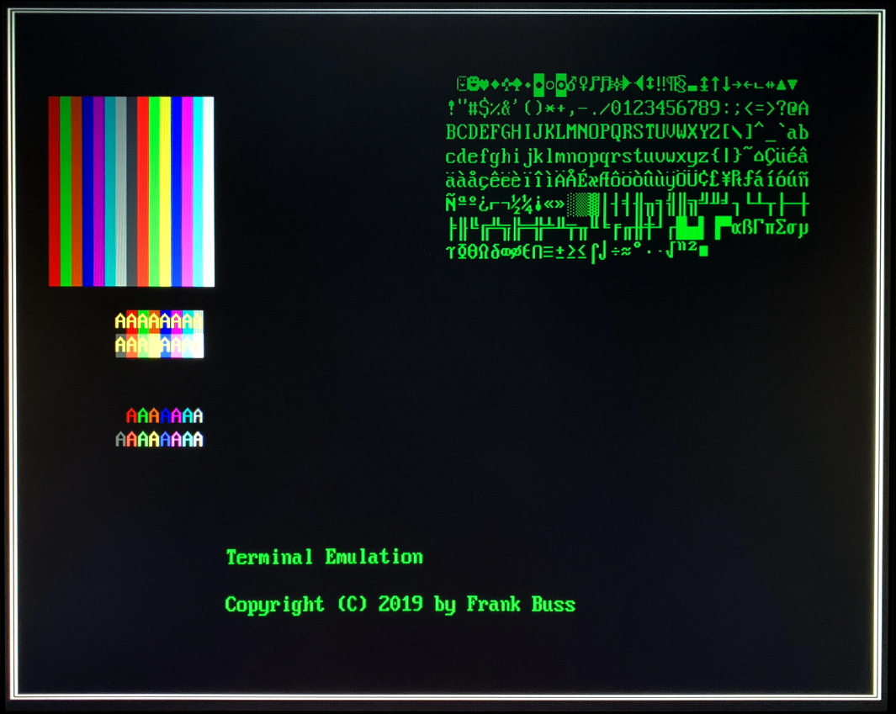
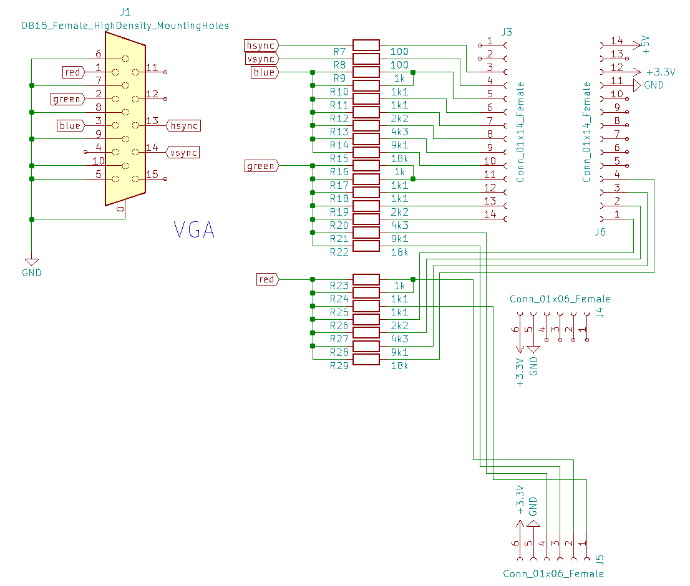
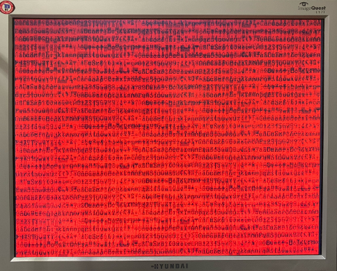

# VGA Terminal emulation

This is a simple terminal emulation with a 640x480 VGA output signal, generated from a 80x30 characters text screen buffer, useful for debugging and terminal applications. It uses standard VGA fonts, with 8x16 pixels per character. The default font uses code page 437, which is used to initialize the RAM and which can be changed with a constructor argument.

The RAM initialization also contains a test image. If all VGA signals are wired correctly, it should look like this on a real monitor, without any initialization by a CPU:



The VGA standard requires a 25.175 MHz clock with +/- 0.5% accuracy, for a framerate of 60 Hz, but most displays don't have problems with 25 MHz. The VGA clock is independent of the system clock and can be higher or lower. Internally it uses dual-port block RAM for the text and font.

You can specify the text initialization and the font file with the . If an empty string is passed, it is initialized with 0. The VGA palette is hard-coded in the terminal entity and is the same as the VGA palette in 16 color text mode.

The VGA output signals are 24 bit true color, but you don't need to connect all bits. Example usage with only 6 bits per color component:

```
from litex.soc.cores.terminal.core import Terminal
.
.
.
		# create VGA terminal
        self.mem_map['terminal'] = 0x30000000
        self.submodules.terminal = terminal = Terminal(crg.cd_vga.clk)
        self.add_wb_slave(mem_decoder(self.mem_map["terminal"]), self.terminal.bus)
        self.add_memory_region("terminal", self.mem_map["terminal"], 0x10000)

        # connect VGA pins
        vga = platform.request('vga', 0)
        self.comb += [
            vga.vsync.eq(terminal.vga_vsync),
            vga.hsync.eq(terminal.vga_hsync),
            vga.red.eq(terminal.red[2:8]),
            vga.green.eq(terminal.green[2:8]),
            vga.blue.eq(terminal.blue[2:8])
        ]
.
.
.
```

For the VGA output, a passive R2R network can be used for the DACs for the RGB color signals. The output above was created with the MAX1000 board and this circuit:



For a full example with this board and circuit see [here](https://github.com/FrankBuss/NetHack/blob/NetHack-3.6/fpga/litex/targets/max1000.py).

This also creates a memory mapped region at 0x30000000 for a CPU core, which can be accessed at 4 byte aligned addresses with 32 bit read/write accesses, but only the lowest byte is used (needs less logic compared to a full memory interface with uint8, uint16 and uint32 access). C example program how to use it:

```
typedef unsigned int uint32_t;

int main(void) {
    int d = 0;
    while (1) {
		volatile uint32_t* vga = (volatile uint32_t*) (0x30000000 | 0x80000000);
		for (int y = 0; y < 30; y++) {
			for (int x = 0; x < 80; x++) {
				vga[0] = d++;
				vga[1] = 0x40;
				vga += 2;
			}
		}
    }
    return 0;
}

```

This increments all characters in the text buffer in an infinite loop, which are displayed as black characters on a red backgroud and looke like this:



The memory organization is 4800 bytes for the text, line by line, first the character code, then the color code for each character, followed by 4096 bytes for the font. The color byte uses the lower nibble for the foreground color and the higher nibble for the background color. See [here](https://en.wikipedia.org/wiki/Video_Graphics_Array#Color_palette) for the palette.

The font file is from [this](https://github.com/perillamint/dkbfnts/blob/master/fntcol16/) repository, which has also font files for other code pages. You can use any `.f16` file. If you don't want to initialze the RAM with a font or init text, you can create the object like this, which results in a black screen on startup:

```
Terminal(crg.cd_vga.clk, screen_init_filename='', font_filename='')
```

Copyright (c) 2019 Frank Buss <fb@frank-buss.de>, License: BSD.
