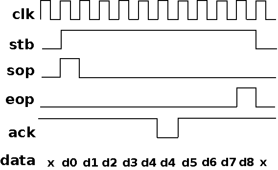

.. _frontend-index:

===================
Frontend interfaces
===================

All frontend modules of LiteSATA share the same user interface based on packets.
An interface has 2 endpoints:

 - A Sink used to send commands and write data.
 - A Source used to receive commands acknowledges and read data.

Packets and user commands/responses are described in the next sections.

Packet description
==================

Sink and Source endpoints use packets with additional parameters. A packet has the following signals:

 - :code:`stb`: Strobe signal, indicates that command or data is valid.
 - :code:`sop`: Start Of Packet signal, indicates that current command or data is the first of the packet.
 - :code:`eop`: End Of Packet signal, indicates that current command or data is the last of the packet.
 - :code:`ack`: Acknowledge signal, indicates the destination is able to accept current data.
 - :code:`data`: Data signal.

   An example of packet transaction between endpoints.

.. tip::

	- When a packet only has a :code:`data`, :code:`sop` and :code:`eop` must be set to 1 on the same clock cycle.
	- A :code:`data` is accepted when :code:`stb` =1 and :code:`ack` =1.

User Commands
=============

All transfers are initiated using the Sink endpoint of the interface which has the following signals:

 - :code:`write`: 1 bit signal, indicates if we want to write data to the HDD.
 - :code:`read`: 1 bit signal, indicates if we want to read data from the HDD.
 - :code:`identify`: 1 bit signal, indicates if the command is an identify device command (use to get HDD information).
 - :code:`sector`: 48 bits signal, the sector number we are going to write or read.
 - :code:`count`: 16 bits signal, the number of sectors we are going to write or read.
 - :code:`data`: n x 32 bits signal, the write data. (n depends of the frontend module)

.. tip::

	- :code:`write`, :code:`read`, :code:`identify`, :code:`sector`, :code:`count` are parameters which must remain constant for the duration of the packet.
	- :code:`sector`, :code:`count` are ignored during an :code:`identify` command.
	- :code:`data` is ignored during a :code:`read` or :code:`identify` command.

User Responses
==============

Responses are obtained from the Source endpoint which has the following signals:

 - :code:`write`: 1 bit signal, indicates if the command was a write.
 - :code:`read`: 1 bit signal, indicates if the command was a read.
 - :code:`identify`: 1 bit signal, indicates if the command was an identify device command.
 - :code:`last`: 1 bit signal, indicates if this is the last packet of the response. (A response can be return in several packets)
 - :code:`failed`: 1 bit signal, indicates if an error was detected in the response (CRC, FIS...)
 - :code:`data`: n x 32 bits signal, the read data. (n depends of the frontend module)

.. tip::

	- :code:`write`, :code:`read`, :code:`identify`, :code:`last` are parameters that must remain constant for the duration of a packet.
	- :code:`data` can be ignored in the case of a :code:`write` or :code:`identify` command.
	- in case of a :code:`read` command, read data packets are presented followed by an empty packet indicating the end of the transaction (last=1).

================
Frontend modules
================

LiteSATA provides a configurable and flexible frontend that can be used to:

- Provides any number of user ports.
- Generate RAID configurations when used with multiple HDDs.

Crossbar
========

The crossbar allows the user to request any number of ports for their application. It automatically arbitrates requests and dispatches responses to the corresponding ports.

The following example creates a crossbar and 2 user ports:

.. code-block:: python

    self.submodules.sata_crossbar = LiteSATACrossbar(self.sata_core)
    user_port0 = self.sata_crossbar.get_port()
    user_port1 = self.sata_crossbar.get_port()

Striping
========

The striping module segments data so that data is stored on N different controllers (RAID0 equivalent).

.. code-block:: python

                     +----> controller0 (dw)
    port (N*dw) <----+----> controllerX (dw)
                     +----> controllerN (dw)

Characteristics:
  - :code:`port`'s visible capacity = N x :code:`controller`'s visible capacity
  - :code:`port`'s throughput = N x (slowest) :code:`controller`'s throughput

It can be used to increase capacity and writes/reads speed.

The following example creates a striping with 2 HDDs:

.. code-block:: python

    self.submodules.sata_striping = LiteSATAStriping([self.sata_core0, self.sata_core1])

:code:`sata_striping`'s Sink and Source are the user interface.

Mirroring
=========

The mirroring module handles N controllers and provides N ports (RAID1 equivalent).

Each port has its dedicated controller for reads:

.. code-block:: python

        port0 <----> controller0
        portX <----> controllerX
        portN <----> controllerN

Writes are mirrored on each controller:

.. code-block:: python

                   (port0 write)                |                 (portN write)
        port0 ----------+----> controller0      |      port0 (stalled) +-----> controller0
        portX (stalled) +----> controllerX      |      portX (stalled) +-----> controllerX
        portN (stalled) +----> controllerN      |      portN ----------+-----> controllerN

Writes have priority on reads. When a write is presented on one of the ports, the module waits for all ongoing reads to finish and commute to write mode. Once all writes are serviced it returns to read mode.

Characteristics:
  - :code:`port`'s visible capacity = :code:`controller`'s visible capacity
  - total writes throughput = (slowest) :code:`controller`'s throughput
  - total reads throughput = N x :code:`controller`'s throughput

It can be used for data redundancy and/or to increase the total read speed.

The following example creates a mirroring with 2 HDDs:

.. code-block:: python

    self.submodules.sata_mirroring = LiteSATAMirroring([self.sata_core0, self.sata_core1])

:code:`sata_striping`'s :code:`ports[0]` and :code:`ports[1]` are the user interfaces.

Module combinations
===================

Since all frontend modules share the same interface, it's easy to combine them together.

In the following code, we have 4 HDDs, do a striping with (0,1) and (2,3), a mirroring on top of that and then create a crossbar on the first port of our mirroring module:

.. code-block:: python

    self.submodules.sata_striping0 = LiteSATAStriping([self.sata_core0, self.sata_core1])
    self.submodules.sata_striping1 = LiteSATAStriping([self.sata_core2, self.sata_core3])
    self.submodules.sata_mirroring = LiteSATAMirroring([self.sata_striping0, self.sata_striping1])
    self.submodules.sata_crossbar = LiteSATACrossbar(self.sata_mirroring.ports[0])
    self.user_port0 = self.sata_crossbar.get_port()
    self.user_port1 = self.sata_crossbar.get_port()

This code provides the following user interfaces: :code:`self.user_port0`, :code:`self.user_port1` and :code:`self.sata_mirroring.ports[1]`.

Examples
========

Since it's probably easier to figure out how to use the frontend modules with real use cases, we provides example designs:

- A BIST_ (Data generator and checker) design that can be used to understand how to connect your logic to the user_port provided by the crossbar.

- A Striping_  design that can be used to understand how to combine 4 HDDs together in striping mode and do a BIST on it.

- A Mirroring_ design that can be used to understand how to combine 4 HDDs together in mirroring mode and do a BIST on it.

.. _BIST: https://github.com/m-labs/misoc/blob/master/misoclib/mem/litesata/example_designs/targets/bist.py

.. _Striping: https://github.com/m-labs/misoc/blob/master/misoclib/mem/litesata/example_designs/targets/striping.py

.. _Mirroring: https://github.com/m-labs/misoc/blob/master/misoclib/mem/litesata/example_designs/targets/mirroring.py
