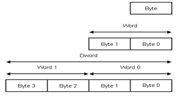

.. _sata-index:

========================
SATA Specification
========================

.. note::
	This chapter is a lightly modified version of the excellent SATA summary found in Chapter 2 of Erik Landström's Thesis_.

Serial Advanced Technology Attachment (SATA) is a serial link replacement of
Parallel ATA (PATA), both standards for communication with mass storage devices.
This high-speed serial link is a differential layer that utilizes Gigabit technology
and 8b/10b encoding. The link supports full duplex but the protocol only permits frames
in one direction at a time. The other non-data direction is used for flow control of the
data stream

.. figure:: sata_layers.png
   :scale: 50 %
   :align: center

   SATA layers.

SATA's architecture consists of four layers, Application, Transport, Link, and Physical.
The Application layer is responsible for overall ATA commands and of controlling SATA
register accesses. The transport layer places control information and data to be transferred between
the host and corresponding SATA device in a data packets. One such packet is called a frame
information structure (FIS). The Link layer is responsible for taking data from a FIS and
encode/decode it using 8b/10b. It also inserts control characters for flow control and calculates
the cyclic redundancy check (CRC) for error detection. Finally the Phy layer’s task is to deliver
and receive the encoded serial data stream on the wire.

Dword - Data Representation
===========================
In the SATA standard the smallest allowed data is a Dword, its 32 bits are divided
into four bytes. Where each pair of bytes represent a word and a pair of words
represent a Dword. In this way it’s easy to see that odd number of bytes is not
allowed in SATA communication.

   Byte, Word, Dword definitions.

The Dwords can be represented by either a data Dword or a so called primitive. A
primitive is a predefined Dword like for example start of frame (SOF) and end
of frame (EOF).

Primitives
==========
Primitives are Dwords with a purpose to enable and control the serial communication.
They all begin with a control character followed by three other characters to
fill up the Dword. The control character makes it easy to recognize a primitive from
a ordinary Dword of a frame. There is 18 different primitives, all with a dedicated
task like for example mark a frame with a SOF or to provide synchronization
with the SYNC.

8b/10b - Encoding
=================
8b/10b encoding is rather common in high speed applications, it’s used to provide
bounded disparity but still provide enough toggling to make clock recovery possible
(synchronize internal clock with the data stream). The bounded disparity means
that in a string of twenty bits the difference between zeros and ones shall be -2, 0,
or 2 and with a maximum runlength of five. The drawback is the created overhead
of two bits per byte making the actual transfer speed of for example 1.5 Gbps link
to 1.2 Gbps, a loss of 20 %. Since the 8b/10b extends the possible alphabet from
256 symbols to 1024 it can provide detection and encoding of special characters
(also called k-characters) in an easy and effective way. This is used in the SATA
standard by encoding every primitive as such special characters.

Out of Band Signaling
======================
Since SATA devices and hosts always sends junk over its differential channels,
when it is idle (otherwise the link is considered lost), there has to be a way of
recognizing a signal before a link has been initialized. For this SATA uses so
called out of band signaling (OOB) to initialize a connection between a host and a
device. The OOB mechanism supports low speed transmission over a high speed
connection, such as a SATA link. The OOB signals are non-differential but are sent
over a differential channel. This is possible by letting the differential transmitters
drive their output pins to the same voltage, resulting in a reduced difference and
when a preset threshold limit is reached the receiver can recognize the signal as
OOB.

.. figure:: oob_signals.png
   :scale: 50 %
   :align: center

   OOB signals.

As can be seen in the figure there are three types of (actually two
since COMINIT and COMRESET are equal) valid OOB signals where bursts of
six ALIGN are sent with different timing. The importance in the signaling lies
in the timing, it does not really matter if an ALIGN or something else are sent
because the receiver only detects the drop of voltage difference between rx+ and
rx-. In the next figure the complete startup sequence is visualized and
the calibration steps in it are optional to implement. The host sends COMRESET
until the device is powered on and can respond with a COMINIT. Upon reception
of the COMINIT the host sends a COMWAKE to the device which shall send a
COMWAKE back. If this procedure is finished within a correct time the OOB signaling
ends and the differential communication can proceed with determining the link speed
(right part of the figure).

.. figure:: oob_sequence.png
   :scale: 50 %
   :align: center

   OOB init sequence.

Physical Layer
==============
This section describes the physical interface towards the actual SATA link.
The features of the phy can be summarized to:

  - Transmit/Receive a 1.5 Gbps, 3.0 or 6.0 Gbps differential signal
  - Speed negotiation
  - OOB detection and transmission
  - Serialize a 10, 20, or other width parallel data from the link layer
  - Extract data from the serial data stream
  - Parallelize the data stream and send it to the link layer
  - Handle spread spectrum clocking (SSC), a clock modulation technique used
    to reduce unintentional interference to radio signals

At startup the physical layer is in its OOB state and after a link has been initiated
it changes to Idle Bus condition and normal SATA communication is now
supported. Since the SATA connection is noisy the physical layer detects a frame
when it receives a SOF primitive and it will keep on listening to the incoming
signal until an EOF primitive is received. Except from FIS the SATA traffic
also consists of single primitives which all are easy for the PHY to recognize because
of their starting control character.

Link Layer
==========
This section describes the SATA link layer.
The link layer’s major tasks are:

  - Flow control
  - Encapsulate FISes received from transport layer
  - CRC generation and CRC check
  - FIS scrambling and de-scrambling
  - 8b/10b encoding/decoding

A FIS is framed between a SOF and a EOF creating the boundaries of a frame.
The last Dword before a EOF is the CRC value for the FIS. The CRC is calculated
by applying the 32-bits generator polynomial G(x) in Equation on every bit in
every non-primitive Dword in a FIS and then summarize (modulo 2) all these terms
together with the Initial Value. The CRC is fixed to value of 0x52325032.

.. figure:: crc.png
   :scale: 50 %
   :align: center

   CRC polynom.

Scrambling a FIS reduces EMI by spreading the noise over a broader frequency
spectrum. The scrambling algorithm can be expressed as a polynomial or as a linear
feedback shift register. The scrambling creates a pseudorandom bit pattern of the
data that reduces EMI. The algorithm resets to a of value of 0xFFFF every time a SOF
is encountered at the scrambler. The de-scrambler uses the same algorithm on scrambled
data so it retakes its original form.

.. figure:: scrambler.png
   :scale: 50 %
   :align: center

   Scrambler LFSR polynom.

It is important that the CRC calculations are made at original data and that
the scrambling/de-scrambling are made between the CRC and the 8b/10b encoding/decoding.
The flow control between host and device is managed by sending
primitives to one another telling its status (which originates from the transport
layer). Some of these primitives can be inserted into FIS. Primitives are not
supposed to be scrambled or added to the CRC sum. Internally the flow control
are regulated by signaling between the layers.

Transport Layer
===============
The main task for the SATA transport layer is to handle FISes and a brief description
of the layer’s features follows:

  - Flow control
  - Error control
  - Error reporting
  - FIS construction
  - FIS decomposition
  - FIS buffering for retransmission

There are eight types of FISes each with its specific 8-bit ID and unique header.
FISes vary in size from 1 Dword up to 2049 Dwords. The number of bytes in a
FIS are always a multiple of four so the transport layer has to fill up with zeros if
there are bytes or bits missing for an entire Dword.
The flow control in this case is only to report to the link layer that the data buffers
are close to over- or underflow. Errors detected are supposed to be reported to
the application layer and the detectable errors are:

  - Errors from lower layers like 8b/10b disparity error or CRC errors.
  - SATA state or protocol errors caused by standard violation.
  - Frame errors like malformed header.
  - Internal transport layer errors like buffer overflow.

Errors are handled in different ways, for example are resending of complete FISes
supported for all kind of FISes besides the data FISes (and the BIST FIS which
is used typically during testing), because that would need buffers in size of 8192
bytes (maximum supported FIS size). The max sized non-data FIS is 28 bytes so
the costs of a large buffer can be spared.

Command Layer
=============
The command layer tells the transport layer what kind of FISes to send and receive
for each specific command and in which order those FISes are expexted to be delivered.

.. note::
	This chapter is a lightly modified version of the excellent SATA summary found in Chapter 2 of Erik Landström's Thesis_.

.. _Thesis: http://www.diva-portal.org/smash/get/diva2:207798/FULLTEXT01.pdf
